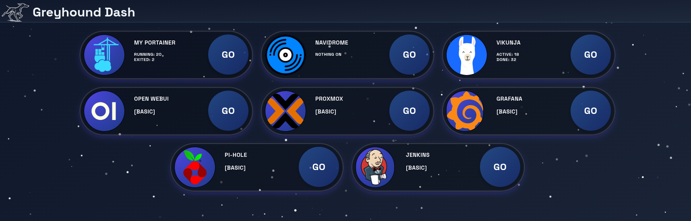

# Greyhound Dashboard

Greyhound Dashboard is a Django-based web application for managing and monitoring self-hosted services. It provides a unified dashboard to view the status and enhanced data of various services such as Navidrome, Vikunja, Portainer, and more.



## Features

- **Service Registry:** Register and manage multiple service types.
- **Enhanced Services:** Support for enhanced service data (e.g., now playing, task stats).
- **Dynamic UI:** Real-time updates using [htmx](https://htmx.org/) and custom Django templates.
- **Admin Interface:** Manage registered services via Django admin.
- **Extensible:** Easily add new services by implementing service classes.

## Project Structure

```
greyhoundDashboard/
    core/
        admin.py
        models.py
        views.py
        services/
        static/
        templates/
    services/
        basic_services.py
        service_base.py
        navidrome/
        portainer/
        vikunja/
    tests/
    manage.py
    db.sqlite3
    greyhoundDashboard/
        settings.py
        urls.py
        wsgi.py
requirements.txt
readme.md
```

## Getting Started

### Prerequisites

- Python 3.10+
- [pip](https://pip.pypa.io/en/stable/)
- [virtualenv](https://virtualenv.pypa.io/en/latest/) (recommended)

### Installation

1. **Clone the repository:**
    ```sh
    git clone git@github.com:JTSG1/GreyhoundDash.git
    cd greyhoundDashboard
    ```

2. **Create and activate a virtual environment:**
    ```sh
    python -m venv venv
    source venv/bin/activate
    ```

3. **Install dependencies:**
    ```sh
    pip install -r requirements.txt
    ```

4. **Apply migrations:**
    ```sh
    python manage.py migrate
    ```

5. **Create a superuser (optional, for admin access):**
    ```sh
    python manage.py createsuperuser
    ```

6. **Run the development server:**
    ```sh
    python manage.py runserver
    ```

7. **Access the dashboard:**
    - Visit [http://localhost:8000/](http://localhost:8000/) in your browser.

## Usage

- Register new services via the Django admin interface.
- The dashboard will display all registered services and their enhanced data.
- Service data is updated dynamically using htmx.

## Adding a New Service

1. Create a new folder under [`services/`](greyhoundDashboard/core/services/__init__.py ) for your service.
2. Implement a service class inheriting from [`ServiceBase`](greyhoundDashboard/services/service_base.py ) or [`EnhancedServiceBase`](greyhoundDashboard/services/service_base.py ).
3. Register your service using the [`register()`](venv/lib64/python3.13/site-packages/django/contrib/admin/sites.py ) class method.
4. Add a corresponding HTML template for enhanced output.

## Running Tests

```sh
pytest
```

## License

MIT License

---

**Note:** This project is under active development. Contributions and